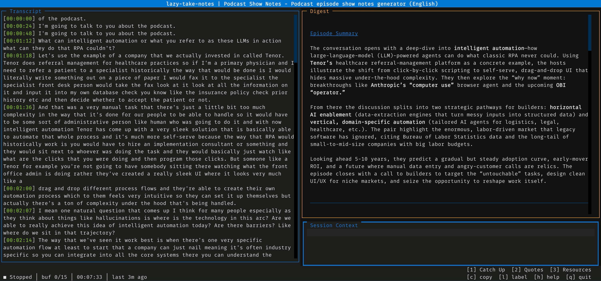

<p align="center">
  
</p>

Terminal app for live transcription and note-taking. Records your mic, transcribes speech to text, and periodically generates structured digests of what's happening.



## Requirements

- Python 3.11+
- A microphone
- A transcription engine ([whisper.cpp](https://github.com/ggerganov/whisper.cpp) by default)
- An LLM backend ([Ollama](https://ollama.com) by default)

## Install

```bash
# try without installing (uv required)
uvx --from git+https://github.com/CJHwong/lazy-meeting-note.git lazy-take-notes

# or clone and install locally
uv sync

# or pip
pip install -e .
```

## Run

```bash
lazy-take-notes                               # start with defaults
lazy-take-notes --config path/to/config.yaml  # custom config
lazy-take-notes --output-dir ./my_session     # custom output dir
lazy-take-notes --audio-file recording.m4a    # batch-transcribe a file
```

## Keys

| Key     | Action                          |
| ------- | ------------------------------- |
| `Space` | Pause / resume recording        |
| `s`     | Stop recording                  |
| `c`     | Copy focused panel to clipboard |
| `Tab`   | Switch panel focus              |
| `h`     | Help                            |
| `q`     | Quit                            |

Templates can add more keys for quick actions (catch up, action items, etc). Press `h` in the app to see all available bindings.

## Config

Config lives in your OS config directory:

| OS      | Path                                             |
| ------- | ------------------------------------------------ |
| macOS   | `~/Library/Application Support/lazy-take-notes/` |
| Linux   | `~/.config/lazy-take-notes/`                     |
| Windows | `C:\Users\<you>\AppData\Local\lazy-take-notes\`  |

Example `config.yaml`:

```yaml
transcription:
  model: "large-v3-turbo-q8_0"    # default whisper model
  models:                         # per-locale overrides
    zh: "breeze-q8"               # Breeze ASR, optimized for Traditional Chinese
  chunk_duration: 25.0
  overlap: 1.0
  silence_threshold: 0.01
  pause_duration: 1.5
digest:
  model: "gpt-oss:120b-cloud"     # heavy model for periodic digests
  min_lines: 15
  min_interval: 60
  compact_token_threshold: 100000
interactive:
  model: "gpt-oss:20b-cloud"      # fast model for quick actions
ollama:
  host: "http://localhost:11434"
output:
  directory: "./output"
  save_audio: true                # save recording.wav alongside transcript
```

## Templates

Templates control the LLM prompts, labels, and quick-action keys for a session. The template picker launches at startup — built-ins are listed there.

To add your own or override a built-in, drop a `.yaml` file in the `templates/` subdirectory of your config path (see table above). See [TEMPLATES.md](TEMPLATES.md) for the full schema and variable reference.

## Output

After a session:

```
output/
├── transcript_raw.txt        # timestamped transcript
├── digest.md                 # latest digest (markdown)
├── session_context.txt       # user-provided context (if any)
├── recording.wav             # audio recording (when save_audio: true)
└── history/
    ├── digest_001.md
    ├── digest_002.md
    └── digest_003_final.md   # final digest on quit/stop
```

## Development

```bash
uv sync                  # install deps
uv run pytest tests/ -v  # run tests
uv run lint-imports      # check layer contracts
```

Architecture details are in [AGENTS.md](AGENTS.md).

## License

MIT
